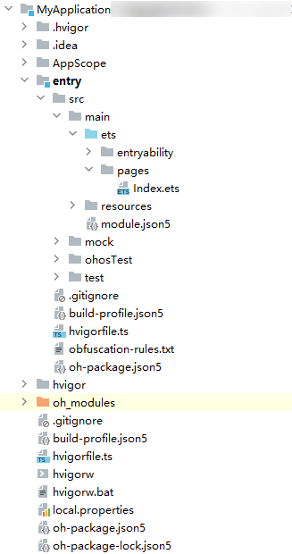
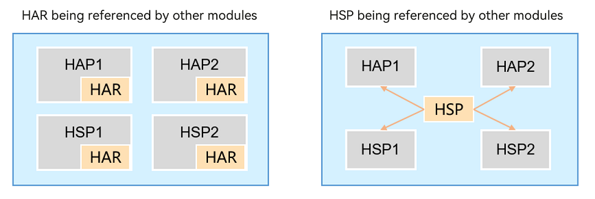

This topic explores the structure of an application package in the phase of application development.

**Content table:**  
- [Application Model Overview](#application-model-overview)  
- [Package Structure in the Development Phase](#package-structure-in-the-development-phase)  
- [Selecting a File Type](#selecting-a-file-type)  

## Application Model Overview

The system has provided two application models:

- Feature Ability (FA) model: This model is supported by API versions 7 and 8, and no longer recommended.

- Stage model: This model is supported since API version 9. It is the mainstream model with a long evolution plan. In this model, classes such as **AbilityStage** and **WindowStage** are provided as the stage of application components and windows. That's why it is named stage model.

## Package Structure in the Development Phase  
To have a clearer idea on the application package structure, it would be helpful if you have a project directory at hand. As such, first create a project in DevEco Studio and add modules of different types to the project.

**Figure 1** Project structure (for reference only)  

The table below lists the main file types in the project structure.
> **NOTE**
>
> - The **AppScope** directory is automatically generated by DevEco Studio and its name cannot be changed.
> - The module directory name can be automatically generated by DevEco Studio (for example, **entry** and **library**) or customized. For ease of description, **Module_name** is used below to represent the module directory name.

| File Type| Description|
| -------- | -------- |
| Configuration files| A collection of application-level and module-level configurations.  - **AppScope &gt; [app.json5](https://gitee.com/openharmony/docs/blob/master/en/application-dev/quick-start/app-configuration-file.md)**: application-wide configuration, such as the bundle name, version number, application icon, application name, and dependent SDK version number.  - **Module_name &gt; src &gt; main &gt; [module.json5](https://docs.openharmony.cn/pages/v4.1/en/application-dev/quick-start/module-configuration-file.md)**: basic information, supported device types, component information, and required permissions of the module.|
| ArkTS source code files| **Module_name &gt; src &gt; main &gt; ets**: ArkTS source code files of the module.|
| Resource files| A collection of application-level and module-level resource files, including images, multimedia, strings, and layout files. For details, see [Resource Categories and Access](https://docs.openharmony.cn/pages/v4.1/en/application-dev/quick-start/resource-categories-and-access.md).  - **AppScope &gt; resources**: resource files required for the application.  - **Module_name &gt; src &gt; main &gt; resources**: resource files required for the module.|
| Other configuration files| A collection of files used for compilation and building, including build configuration files, build scripts, obfuscation rule files, and files declaring dependencies.  - **build-profile.json5**: project-level or module-level build configurations, including application signatures and product configurations.  - **hvigorfile.ts**: application-level or module-level build script. You can specify the compilation and build tool version and configuration parameters for controlling build behavior.  - **obfuscation-rules.txt**: obfuscation rule file. When obfuscation is enabled, DevEco Studio compiles, obfuscates, and compresses code during builds in Release mode.  - **oh-package.json5**: information about dependencies, including dependent third-party libraries and shared packages.|

## Selecting a File Type
There are two types of modules by usage scenario:

- **Modules of the ability type**: used to implement application functionality. Each module of the ability type is built into a Harmony Ability Package (HAP), in .hap format. As a basic unit for application installation, a HAP can be installed and run separately. An application contains one or more HAPs. Depending on the module from each it is built, a HAP is of the entry or feature type.
  - Entry HAP: built from an entry module, which serves as the application's main module and implements the application's entry screen, entry icon, or headline feature. Each application package distributed to devices of the same type may contain either zero or one entry HAP.
  - Feature HAP: built from a dynamic feature module. An application can contain zero, one, or more feature HAPs.

- **Modules of the library type**: used to implement code and resource sharing. This type of module can be referenced by other modules multiple times and, when used smartly, can reduce development and maintenance costs. Modules of the library type are classified as static or shared. Each is built into a shared package.
  - Static: static shared library. This type of library is built into a Harmony Archive (HAR), in .har format.
  - Shared: dynamic shared library. This type of library is built into a Harmony Shared Package (HSP), in .hsp format.
  
  > **NOTE**
  > 
  > Actually, a build of the shared library generates a HAR as well as an HSP. The HAR contains the interfaces exported from the HSP and is used by other modules in the application to reference the features of the HSP. For convenience purposes, it is usually considered that a shared library is built into an HSP.
  
  The table below lists the differences between the HAR and HSP.
  
| Shared Package Type | Build and Running | Release and Reference |
|---------------------|-------------------|------------------------|
| HAR                 | The code and resources in the HAR are built with the invoking module, and if there are multiple invoking modules, the build product contains multiple copies of the same code and resources. Note: When building a HAR, you are advised to enable the obfuscation capability to protect code assets. | The HAR can be referenced inside the application and, by being released independently, can be referenced across applications. |
| HSP                 | The code and resources in the HSP are built independently, and the build product contains only one copy of the code and resources. | Generally, the HSP is packaged with the application. Intra-application HSP and integrated HSP are supported. The intra-app HSP can only be referenced in an application; the integrated HSP can be published to the ohpm private repository and referenced in cross-applications. |

 
  **Figure 2** HAR and HSP in the App Pack  
  

## Reference
For additional information please refer to [Overview of Application Configuration Files in Stage Model](https://gitee.com/openharmony/docs/blob/master/en/application-dev/quick-start/application-configuration-file-overview-stage.md) and [Application Models](https://github.com/eclipse-oniro-mirrors/docs/blob/OpenHarmony-4.1-Release/en/application-dev/application-models/application-models.md)