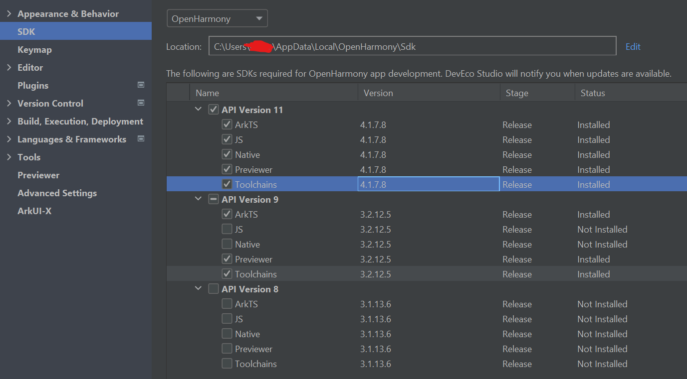

Due to the current limitations of DevEco Studio for OpenHarmony, only a limited number of application sample demos are available. 

Available application samples for OpenHarmony with DevEco Studio 4.1(API 9/API 11):

- [Guess Number](https://github.com/eclipse-oniro4openharmony/app-GuessNumber)  
- [Time Around World](https://github.com/eclipse-oniro4openharmony/app-TimeAroundWorld)  
- [Super Bright Flashlight](https://github.com/eclipse-oniro4openharmony/app-SuperBrightFlashlight)  
- [Bmicalculator](https://github.com/eclipse-oniro4openharmony/app-bmicalculator)  
- [Workout Logbook](https://github.com/eclipse-oniro4openharmony/app-WorkoutLogbook)  
- [Quote Of The Day](https://github.com/eclipse-oniro4openharmony/app-QuoteOfTheDay)  
- [Water Tracker](https://github.com/eclipse-oniro4openharmony/app-WaterTracker)  
- [Magic8Ball](https://github.com/eclipse-oniro4openharmony/app-Magic8Ball)  
- [Throw The Dice](https://github.com/eclipse-oniro4openharmony/app-ThrowTheDice)  


The following apps are recommended to use real device, if you are not familar with runing application on real device, follow the instruction [Running Application on Real Device](../create-first-eclipse-oniro-app/run-real-device.md)

If you have any problem when building the application, check [Common Problems](#common-problems)  

- [Discord](https://github.com/eclipse-oniro4openharmony/app-discord)  
- [Gmail](https://github.com/eclipse-oniro4openharmony/app-gmail)  
- [Youtube](https://github.com/eclipse-oniro4openharmony/app-youtube)  
- [PlayScout](https://github.com/eclipse-oniro4openharmony/app-PlayScout)  
- [Unit Converter](https://github.com/eclipse-oniro4openharmony/app-unitconverter)  
- [Pokemon List](https://github.com/eclipse-oniro4openharmony/app-PokemonList)  
- [Pinwheel](https://github.com/eclipse-oniro4openharmony/app-Pinwheel)  
- [MyList](https://github.com/eclipse-oniro4openharmony/app-MyList)  
- [Duolingo](https://github.com/eclipse-oniro4openharmony/app-duolingo)  
- [MyMeteo](https://github.com/eclipse-oniro4openharmony/app-MyMeteo)  
- [OniroNews](https://github.com/eclipse-oniro4openharmony/app-OniroNews)  
- [OniroGPT](https://github.com/eclipse-oniro4openharmony/app-oniroGPT)(This app you need to get your own token)  


## Common Problems
### install failed due to grant request permissions failed
We need to change application permission level
Solution:
1. Open the directory where the OpenHarmony SDK is located (you can view it by clicking Tools > SDK Manager > OpenHarmony SDK in the DevEco Studio menu bar).


2. Navigate to the Toolchains > {Version} > lib folder under the SDK directory, and open the `UnsignedReleasedProfileTemplate.json` file.


3. Change the parameter in `bundle-info` as following:

```typescript
	"bundle-info":{
    ...
		"apl":"system_core",
		"app-feature":"hos_system_app"
	},
```
> **Note:**
If switching the system permissions does not work, try regenerating the automatic signature files.
