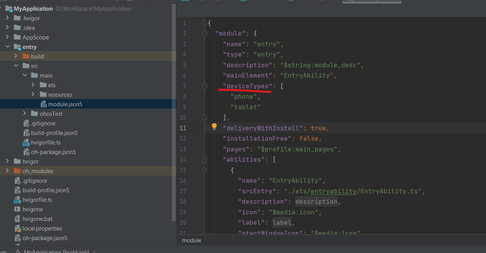

# Common Issues and Solutions

## Cannot find the emulator of a phone device

entry\>src\>main\>module.json5 is the configuration file for the module, check deviceType, add 'phone' if it is missing.

  

## Unable to find BMS Service when running on Emulator

Just wait for an extended period, or try clearing data of this device or creating a new device.

## Unstable USB connection, dev board not detected by IDE

solution worked for me:  

Change USB Power Management Settings

1. Search for and open *Device Manager*.  
2. Click to expand *Universal Serial Bus Controllers*.  
3. Right-click on *USB Root Hub* and select *Properties*.  
4. Uncheck *Power Management* and click *OK*.

    <figure >
        
    </figure>

## compileSdkVersion and releaseType of the app do not match the apiVersion and releaseType on the device

Reason: The compiled SDK version is higher than the actual device.

Solution:  
Step 1: Modify build\_profile.json5 under entry and set apiType to faMode.  
Step 2: Modify build\_profile.json5 under the project, change the compiled version to a lower version.  
Run again, and the problem will be resolved.  
   

## Install Failed

Have the device connected and detected by IDE, click on “run”, the IDE gives the error messages:   
"Install Failed : failed to install bundle. code: 9568289, error: install failed due to grant request permissions failed."  

It should be a permission issue, and now we need to identify the permissions causing the problem.   

[This documentation](https://gitee.com/openharmony/resources/blob/master/systemres/main/config.json) lists all permissions and their levels in OpenHarmony. 

There are three types of permissions used in OpenHarmony for requests, ordered from low to high: normal, system\_basic, system\_core.

If the permission level is set to "availableLevel": "system\_basic", then you need to configure the acls field in the UnsignedReleasedProfileTemplate.json file and include the required high-level permissions in acls. The specific steps are as follows:

set the"profile" with p7b file generated from java \-c commands in build-profile.json5  

