# IDE Installation  
We are using **DevEco Studio** as the IDE  

## Get Package
You can install **DevEco Studio** from [here](https://contentcenter-vali-drcn.dbankcdn.cn/pvt_2/DeveloperAlliance_package_901_9/ee/v3/HqJ-6O2FQny86xtk_dg9HQ/devecostudio-windows-4.1.0.400.zip?HW-CC-KV=V1&HW-CC-Date=20240409T033730Z&HW-CC-Expire=315360000&HW-CC-Sign=BFA444BC43A041331E695AE2CFA9035A957AF107E06C97E793FD3D31D7096A0D) (Current download version is DevEco Studio 4.1) or you can visit the OpenHarmony [release notes](https://docs.openharmony.cn/pages/v4.1/zh-cn/release-notes/OpenHarmony-v4.1-release.md)  
If the **EN** version not available, try translating the page to English
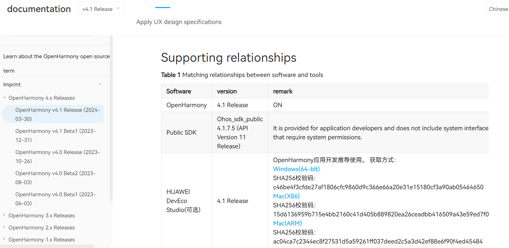

[Windows(64-bit)](https://contentcenter-vali-drcn.dbankcdn.cn/pvt_2/DeveloperAlliance_package_901_9/ee/v3/HqJ-6O2FQny86xtk_dg9HQ/devecostudio-windows-4.1.0.400.zip?HW-CC-KV=V1&HW-CC-Date=20240409T033730Z&HW-CC-Expire=315360000&HW-CC-Sign=BFA444BC43A041331E695AE2CFA9035A957AF107E06C97E793FD3D31D7096A0D)

SHA256：c46be4f3cfde27af1806cfc9860d9c366e66a20e31e15180cf3a90ab05464650

[Mac(X86)](https://contentcenter-vali-drcn.dbankcdn.cn/pvt_2/DeveloperAlliance_package_901_9/3b/v3/JgGp8n0bShOkm1MpBFJ73w/devecostudio-mac-4.1.0.400.zip?HW-CC-KV=V1&HW-CC-Date=20240409T034037Z&HW-CC-Expire=315360000&HW-CC-Sign=35C1F8B3FC19325EBBC32D8E11106DDB074A8ECC6BB3A77FF2EADBA2A8A223DA)

SHA256：15d6136959b715e4bb2160c41d405b889820ea26ceadbb416509a43e59ed7f09

[Mac(ARM)](https://contentcenter-vali-drcn.dbankcdn.cn/pvt_2/DeveloperAlliance_package_901_9/21/v3/D7Jy1StbTwSLUXaA20VrAw/devecostudio-mac-arm-4.1.0.400.zip?HW-CC-KV=V1&HW-CC-Date=20240409T034235Z&HW-CC-Expire=315360000&HW-CC-Sign=19598AAC650D2AB24CAC6DFDF0DBD312188FB0438A8233B7687E6ACDC43A51F8)

SHA256：ac04ca7c2344ec8f27531d5a59261ff037deed2c5a3d42ef88e6f90f4ed45484

## Step by Step Installation
After the download completes, extract the downloaded package and run `deveco-studio-xxxx.exe`. 

Keep clicking `next` until **Choose Install Location** procedure. 
Specify desired installtion path by clicking `Browse...` if necessary and click `next`.
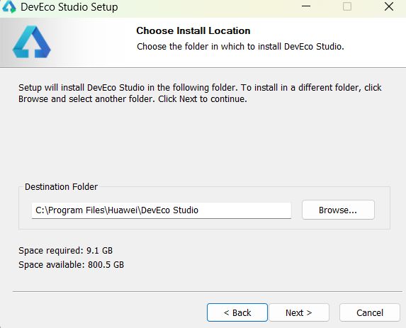  

>**Note:**
Ensure that you delete all files from the previous installation path before proceeding if it's not your first installation.
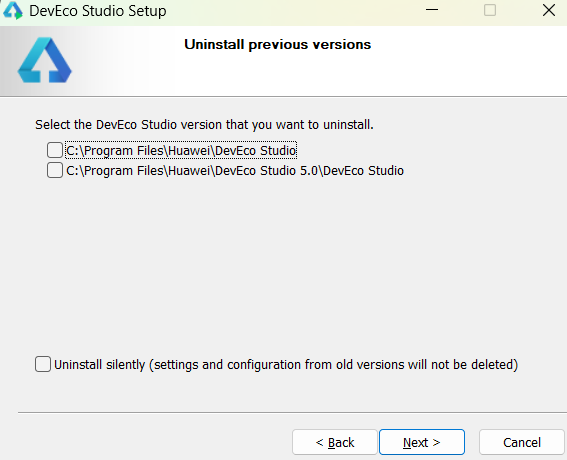  

In **Installation Options** procedure, select `Create Desktop Shortcut`
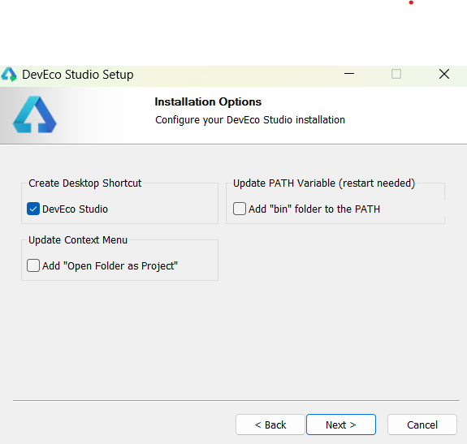  

In **Choose Start Menu Folder** procedure, keep default settings and click `install`.
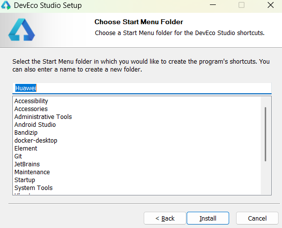  

The installation is finished.
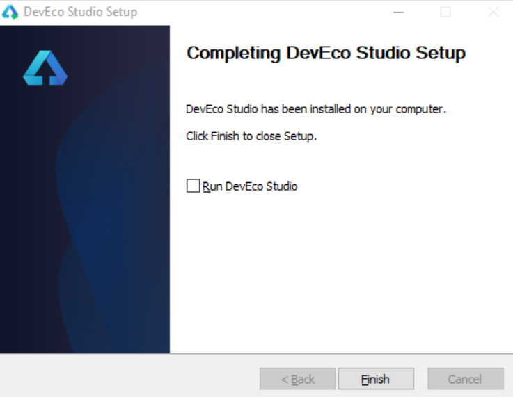  

# Environment Configuration  
Run `DevEco Studio` for the first time, configuation setting pages will appear.  
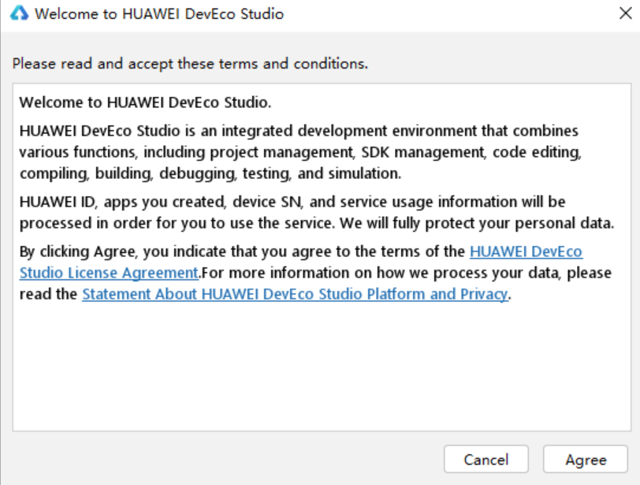  

Select `Do not import settings`  
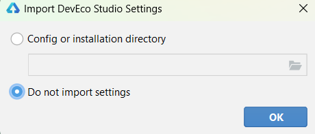  

On `Basic Setup` page, select install for **Node.js** and **Ohpm**.
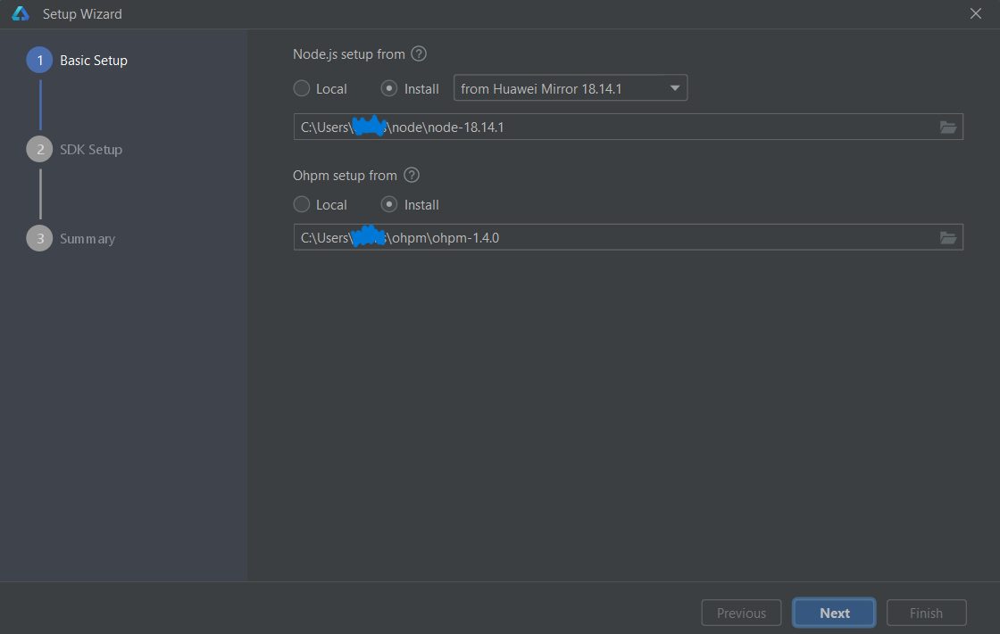  
Click **Next** to proceed to the SDK configuration page, and then set the SDK path to an appropriate location.
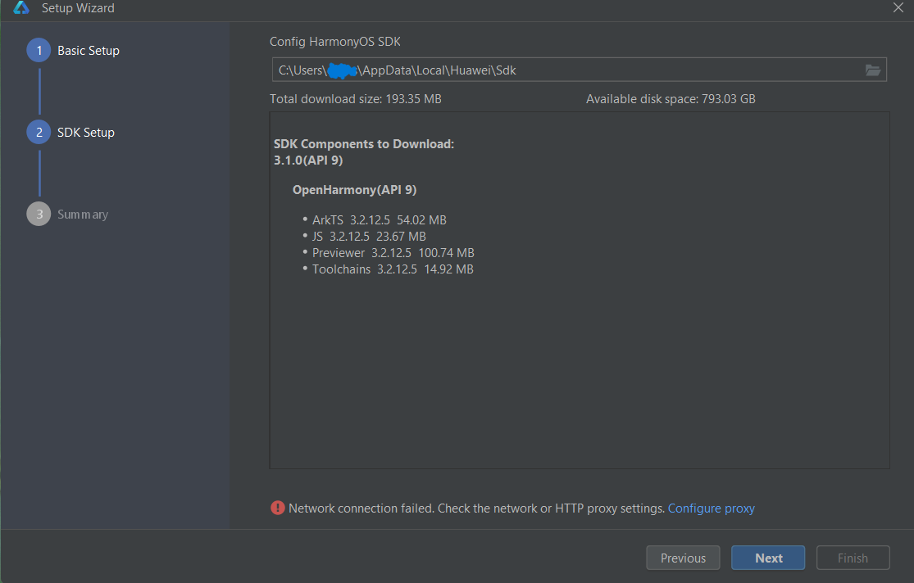  
Accept the License Agreement
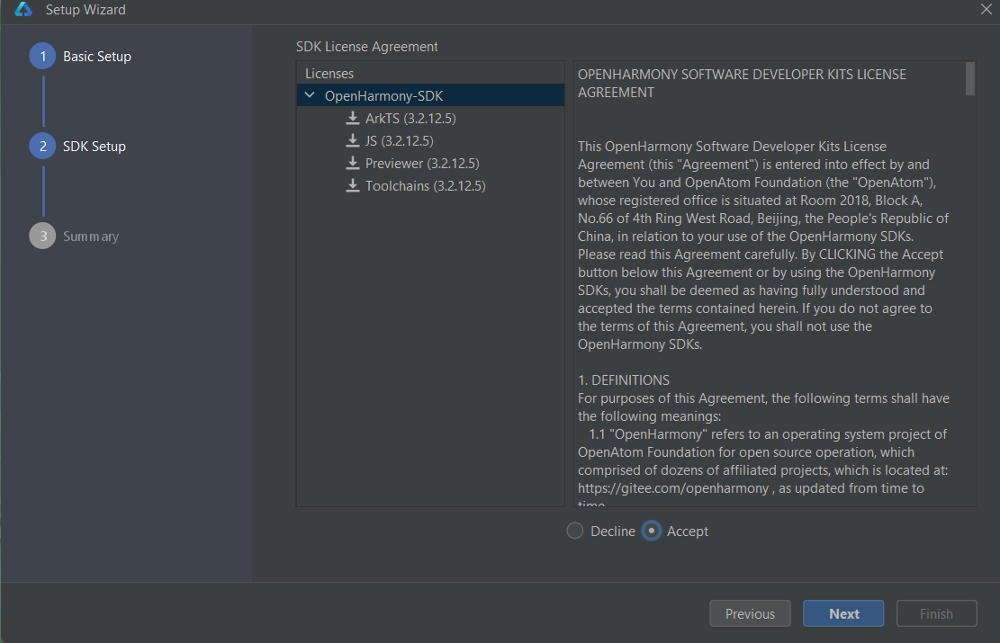  
Check the summary information and go next
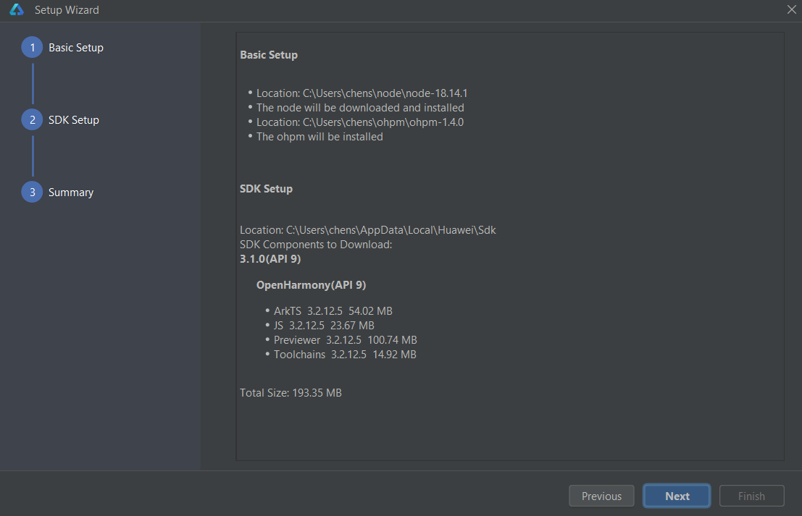  
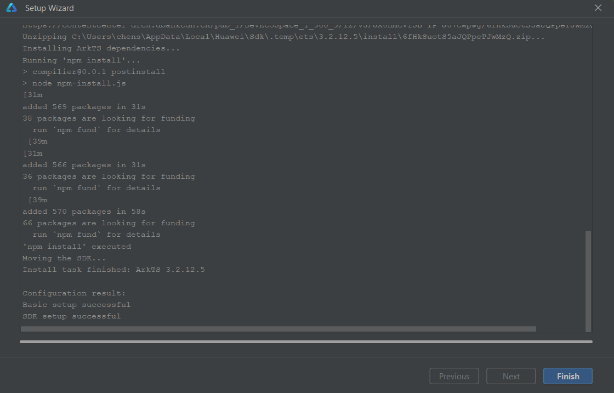  
Environment configuration is finished.
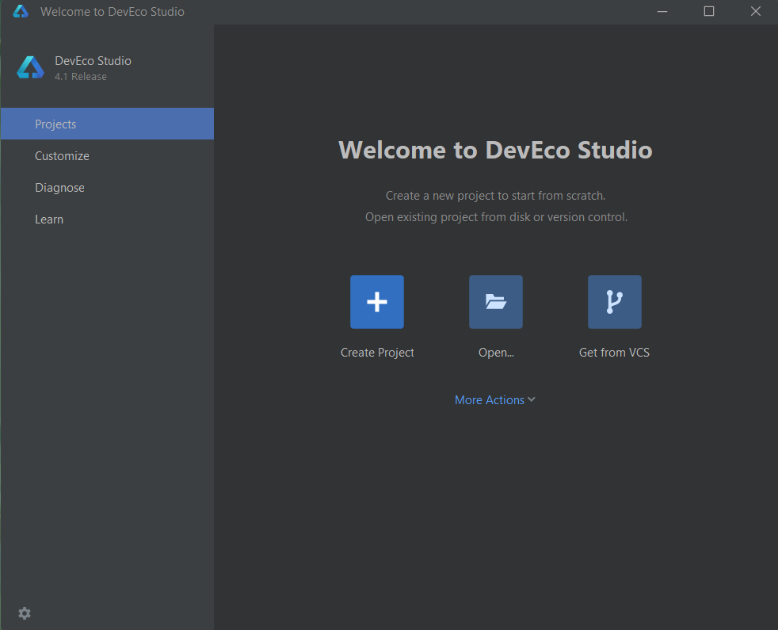  
>**Note:**
If you want to run application for OpenHarmony, you need to install revelent APIs as well. You can download public SDK from `DevEco Studio`->`Tool`->`SDK Manager`->`OpenHarmony`, select API and click `Apply` to download.
(If you downloaded DevEco Studio version is 4.1, choose API Version 11 for development.)
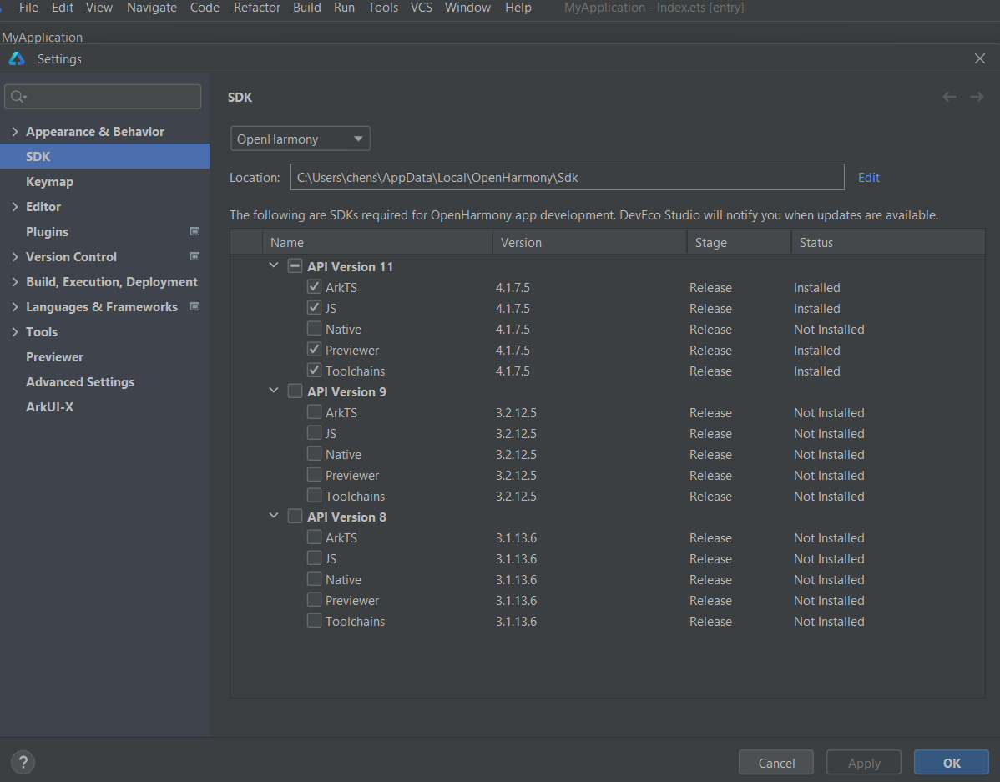  