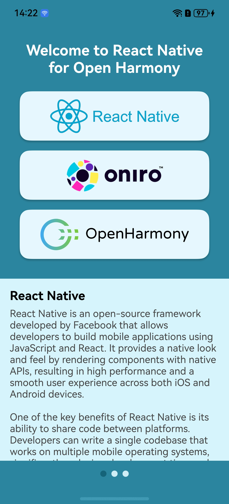

# app-rnoh-example

Example React Native application for Oniro/OpenHarmony.

The aim of this project is to create a template for new React Native applications for Open Harmony, as well as to present the fundamentals of building cross-platform applications in React Native.

The code is divided into two directories:

- **oh-app**: OpenHarmony application template serving as a container for the React Native app.
- **rnoh-app**: The actual React Native app embedded in the OH.

<table>
    <tr>
        <td rowspan="2">
            
        </td>
        <th>Functionalities of the Application</th>
    </tr>
    <tr>
        <td>
            <ul>
                <li><strong>Animation</strong>: Sliding animation for the logo container using <code>Animated</code> API and <code>useRef</code>.</li>
                <li><strong>Button Interaction</strong>: Handling logo press events with the <code>LogoBox</code> component and <code>onPress</code> prop.</li>
                <li><strong>useEffect Hook</strong>: Triggering animations on component mount.</li>
                <li><strong>Reusable Components</strong>: Creating and styling <code>LogoBox</code> for logos.</li>
                <li><strong>Screen Carousel</strong>: Using <code>ScrollView</code> to navigate between screens (<code>Screen1</code>, <code>Screen2</code>, <code>Screen3</code>).</li>
                <li><strong>Dynamic Switching</strong>: Scrolling carousel based on logo press.</li>
                <li><strong>Code Structure</strong>: Modular organization with components and screens.</li>
                <li><strong>Responsiveness</strong>: Adjusting screen width dynamically with <code>Dimensions</code>.</li>
            </ul>
            <p>The app demonstrates React Native features for building interactive and animated UIs.</p>
        </td>
    </tr>
</table>

### Language Corrections

## A quick how-to

The code of the sample application has already been prepared and adapted for compilation with RN, it can serve as a template for other apps.

1. Download project and  dependent libraries:

```
$ git clone https://github.com/eclipse-oniro4openharmony/app-rnoh-example.git
$ cd app-rnoh-example/rnoh-app
$ npm i @react-native-oh/react-native-harmony
$ cd ../oh-app
$ ohpm i @rnoh/react-native-openharmony
```

2. Create a JS bundle with RN app: 
```
$ cd ../rnoh-app
$ npm run dev
```
3. Copy generated bundle to the OH app:

Copy the entire contents of the directory:
```
rnoh-app/harmony/entry/src/main/resources/rawfile
``` 
to the directory:
```
oh-app/entry/src/main/src/main/resources/rawfile
```
4. Compile the **oh-app** with the DevEco. Choose ```File > Sync and Refresh Project``` before compilation.

## Detailed instructions

The project in this repository is already properly configured and adapted. You can use it as a template for your application. However, if you want to create an RNOH application from scratch, you must follow certain steps to embed the React Native application within an Open Harmony application that will serve as a container and bridge between the system and the RN application.

In case of project compilation issues, go directly to the [Troubleshooting](troubleshooting.md) section.