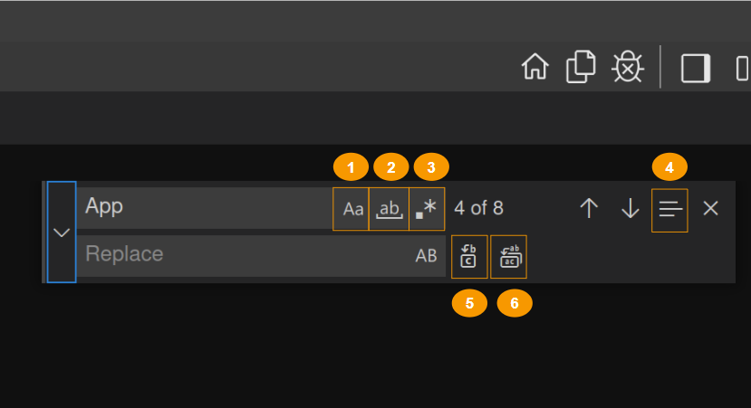

## Keyboard Shortcuts
Being able to keep your hands on the keyboard when writing code is crucial for high productivity. You can explore various keyboard shortcuts by navigating to `File -> Preferences -> Keyboard Shortcuts` from the menu tab or clicking `Ctrl+Alt+,`.

## Selection
Different selection options can be explored from `Selection` in the menu tab. A few of the important ones are `Shift + Right/Left/Up/Down` for basic selection, `Ctrl + Shift + Right/Left`  for whole words selection, and column selection by placing the cursor in one corner and then holding `Shift+Alt` while dragging to the opposite corner.

## Save & Auto Save
To save a file press `Ctrl+S` or enable auto save from `File -> Auto Save` which will save your changes after a configured delay or when focus leaves the editor.

## Find & Replace

Press `Ctrl+F` to toggle the `Find` feature of the IDE, write the word or phrase you're searching for and press `Enter` or `Shift+Enter` to go up and down the results. As seen in the above figure, there are several options to the search namely:

1. **Match Case:** to find a word or phrase with the same case letters.
2. **Match Whole Word:** to eliminate words or phrases that don't contain all the letters of each word from the results.
3. **Use Regular Expression:** For an advanced search using [regular expresions](https://learn.microsoft.com/en-us/visualstudio/ide/using-regular-expressions-in-visual-studio?view=vs-2022).
4. **Find in Selection:** to first select a piece of code and then search only within the selection.
5. **Replace:** to replace each search result with the word or phrase in the *Replace* field.
6. **Replace All:** to replace *all* of the search result with the word or phrase in the Replace field, all in one click.

{: .tip }
> To search multiple files at once press `Ctrl+Shift+F`.
