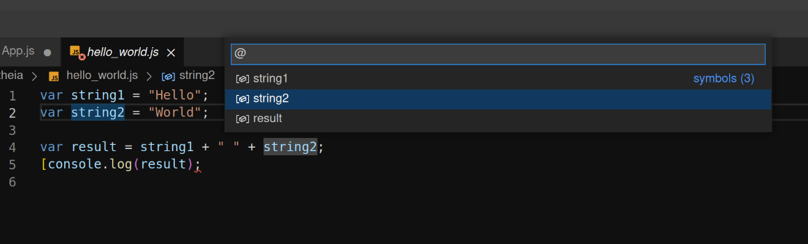

A dynamic combination of programming languages' services and quick text editing gives Oniro IDE its power. In this topic we will give an overview of a few code navigation features which can be explored when you right click on a symbol (variable, function, method, class, etc.).

## Go to Definition
The "Go to Definition" feature is a code navigation tool that allows you to quickly navigate to the definition of a particular symbol in your codebase. This feature is commonly used to explore the implementation or declaration of functions, classes, variables, methods, and other code entities. You can do this by `Ctrl+Click` as with other IDEs or `Ctrl+F11`.

## Go to Type Definition
This feature specifically deals with navigating to the type definition of a symbol. It is useful in statically-typed languages where you might want to see the type information associated with a variable or entity.

## Go to Symbol

This allows you to quickly navigate to symbols (ie. variables, functions, classes..etc) within your file.

## Go to Implementations
The "Go to Implementations" feature allows you to quickly jump to the implementations of a particular function, method, or interface in your codebase. This feature is particularly useful in languages that support interfaces, classes, or methods with multiple implementations.

{:.tip}
>  If you want to see all the places where a particular method or function is implemented, "Find All Implementations" is useful for a more comprehensive overview.

## Find All References
This is a code analysis tool that allows you to locate all occurrences or references to a particular symbol (variable, function, method, class, etc.) within your codebase. Its purpose is to provide developers with a comprehensive overview of where a specific symbol is used throughout their project.

## Peek
This is a special feature that allows developers to quickly view the definition or implementation of a symbol inline without navigating away from the current code file to avoid context switching.

You can navigate between different references in the peeked editor and make quick edits right there.

