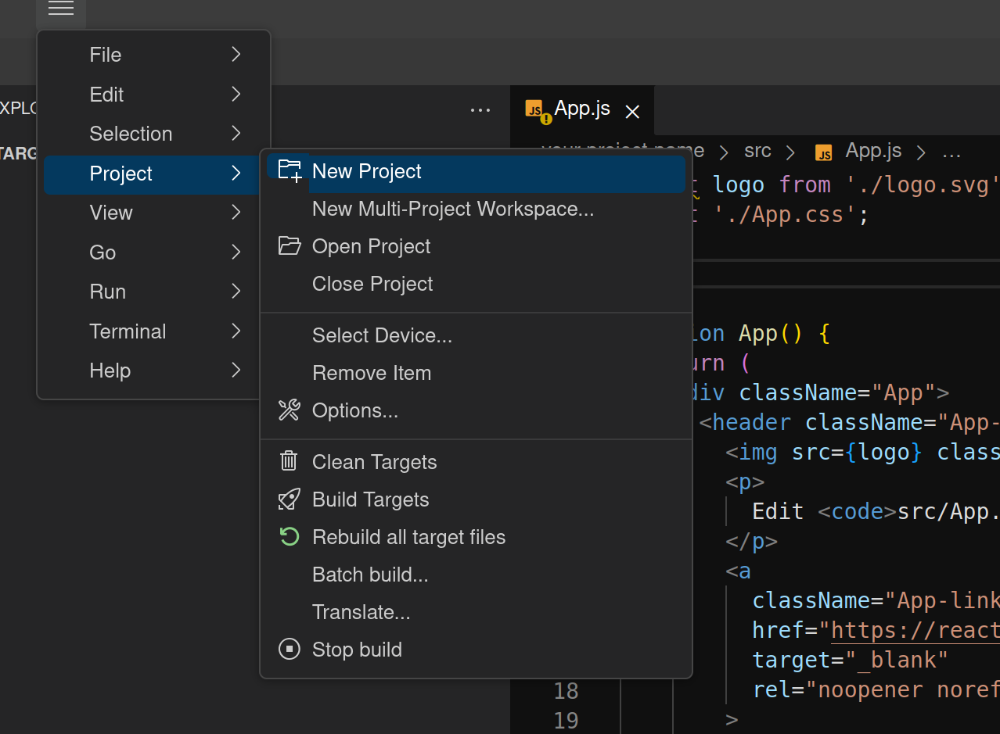

## Installation
Please make sure that your system follows the [Theia development prerequisites](https://github.com/eclipse-theia/theia/blob/master/doc/Developing.md#prerequisites).

### Building
The IDE can be built & run in your browser, or as a packaged desktop application using [Electron](https://www.electronjs.org/).
You can build both browser and electron application by running the following script:
```
yarn
yarn compile
yarn download:plugins
```

### Running
To start the browser application you need to run:
```
yarn browser start
```
And similarly for the electron application:

```
yarn electron start
```

### Watching

To continuously compile the written TypeScript code, run the respective commands for your runtime:

```
yarn browser watch
```
Or

```
yarn electron watch
```
### Running in Docker container
[Install docker](https://docs.docker.com/get-docker/).

 To create `oniro-ide` docker image:

```
docker build -t oniro-ide .
```
To start `oniro-ide-container` container:

```
docker run -dp 3000:3000 --name oniro-ide-container oniro-ide
```
When you open the browser at `http://localhost:3000/` you will see the browser version of the IDE.

## Creating and Running a Project


To create a new project navigate to `Project` from the menu tab and click `New Project`. From the pop-up window select the folder where you want to save your project and give your project a name. Finally select the hardware chip of your choice, click `Next` and `Finish`. This creates a new project workspace for your development.

To open your project, navigate to `File -> Open...` from the menu tab, navigate to your project's location, and click `Open`. This will open your project as you can see down in the `Explorer`.

From here on out you can [add files/folders using the `Explorer` pane](user-interface.md#explorer) or use tools such as [npm](https://www.npmjs.com/) package manager to help you create projects.

> **Note:**
>
> So far you can develop projects in the IDE in a plethora of languages. However, building and running project is still under construction.