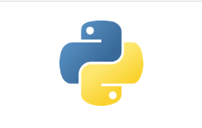
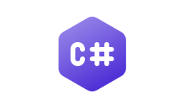

Oniro IDE is built using [Theia](https://theia-ide.org/docs/), which is heavily influenced by VS Code. The languages supported by the IDE are all those supported by VS Code. Examples of such are:

|:-------------|:-------------|:-------------|
|[**Python**](https://code.visualstudio.com/docs/languages/python)|[**C/C++**](https://code.visualstudio.com/docs/languages/cpp)|[**C#**](https://code.visualstudio.com/docs/languages/csharp)|
|[**Go**](https://code.visualstudio.com/docs/languages/go)|[ **Java**](https://code.visualstudio.com/docs/languages/java)|[**Javascript**](https://code.visualstudio.com/docs/languages/javascript)|

The Language Features are also shared with those in VS Code:
- Syntax highlighting and bracket matching
- Smart completions
- Linting and corrections
- Code navigation
- Debugging
- Refactoring