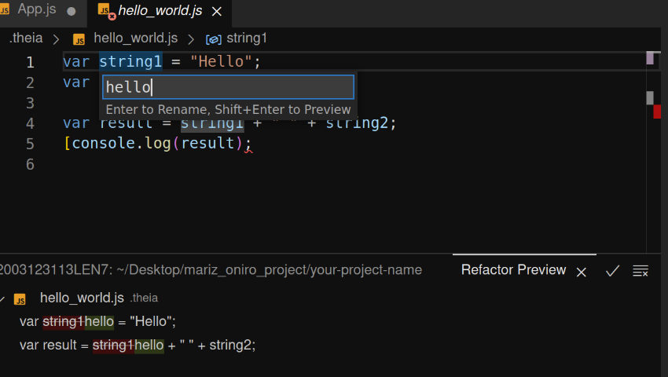

[Code Refactoring](https://refactoring.guru/refactoring) is an essential part of the software engineering life cycle. In this topic we will explain a few refactoring actions that are embedded into the IDE namely, `Rename Symbol`, `Extract Method`, and `Extract Variable`.

## Rename Symbol
This refactoring tool allows you to consistently rename symbols (variables, functions, methods, classes, etc.) throughout your codebase. This is particularly useful when you want to rename a symbol without manually updating each occurrence in different files.



Right click on a symbol you want to rename and choose `Rename Symbol` or press F2. Write the new name and press `Enter`, or press `Shift+Enter` to preview your changes in a separate pane before applying them.

## Extract Method
The "Extract Method" refactoring action in Oniro IDE allows you to take a block of code within a function and create a new method for that block. This can improve code readability, maintainability, and reusability. Here's an example in javascript to illustrate how to use the "Extract Method" feature:

```
function calculateTotal(price, quantity) {
  let taxRate = 0.1;
  let subtotal = price * quantity;
  let tax = subtotal * taxRate;
  let total = subtotal + tax;

  console.log("Total: $" + total.toFixed(2));
}
```

If you want to extract tax calculation part into a separate method you could use the `Extract Method`. Simply select the code fragment, click on the light bulb and choose the scope for the new function. During the extract refactoring, you will be prompted to provide a meaningful name. The final code should look like this:

```
function calculateTotal(price, quantity) {
  let taxRate = 0.1;
  let subtotal = price * quantity;
  let tax = calcTax(subtotal);
  let total = subtotal + tax;

  console.log("Total: $" + total.toFixed(2));
}

function calcTax(subtotal) {
  let taxRate = 0.1;
  return subtotal * taxRate;
}
```

## Extract Variable
allows you to take an expression in your code and create a new variable to store the result of that expression. Let's revisit our initial example:
```
function calculateTotal(price, quantity) {
  let taxRate = 0.1;
  let subtotal = price * quantity;
  let total = subtotal + subtotal * taxRate;

  console.log("Total: $" + total.toFixed(2));
}
```
This time the total is calculated right away in long formula that includes the tax calculation. To make it more readable we want to extract the tax calculation in a separate variable. Hence, we select the `subtotal * taxRate` code fragment, click on the light bulb, choose `Extract to constant in enclosing scope` and give the constant a name e.g. tax. The outcome should be as follows:
```
function calculateTotal(price, quantity) {
  let taxRate = 0.1;
  let subtotal = price * quantity;
  const tax = subtotal * taxRate;
  let total = subtotal + tax;

  console.log("Total: $" + total.toFixed(2));
}
```
